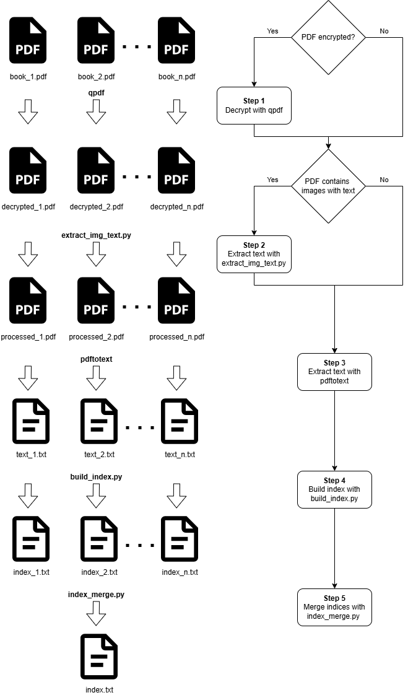

# NoStoneUnturned
Automatic Index Builder

## Overview

Build indexes from PDF or TXT files. 

Casts a wide net but it gets everything. Could be a good option for any open-book with index test.

---
## Requirements

### Optional 3rd Party Accessories
 - qpdf
 - pdftotext

### Python 3.13
 - PyMuPDF
 - Pillow
 - numpy
 - python-doctr
 - torch
 - torchvision
 - pdfminer.six
 - pypdf
 - wordfreq
 - nltk
 - tqdm

---
## Workflow

### 3rd Party Installs

```bash
sudo apt update
sudo apt install qpdf poppler-utils
```

### Python Environment Setup

```bash
python3 -m venv .venv
.venv/bin/python -m pip install -r requirements.txt
```

### Index Building



#### 1. Decrypt PDFs (as required)
```bash
qpdf --password='PASSWORD' --decrypt book_n.pdf decrypted_n.pdf
```

#### 2. Extract text from images (as required)
```bash
./.venv/Scripts/python ./extract_image_text.py decrypted_n.pdf processed_n.pdf
```
This is a time-consuming step that is not required for most PDFs.
Even some PDF that look like they contain images are actually composed of text elements only.

#### 3. Convert to TXT (optional)
```bash
pdftotext processed_n.pdf text_n.txt
```
pdftotext from generally gives slightly better results than extracting from the raw PDF.
However, PDF layout is lost during conversion to text and multi-column elements may be reordered incorrectly.

#### 4. Build index
```bash
./.venv/Scripts/python ./build_index.py -v -o 2 -l 2 -L 50 -F 10 -z 4.0 -r '[a-zA-Z0-9 :.&_-]+' text_n.txt index_n.txt
```
Recommended Settings:
- `-v`  
  Verbose output (does not affect index content)
- `-o 2`  
  PDF page numbering starts on the second page
- `-l 2`  
  Minimum token length for items added to the index
- `-L 50`  
  Maximum token length for items added to the index
- `-F 10`  
  Exclude words appearing on more than 10 pages
- `-z 4.0`  
  Exclude words with a Zipf score > 4.0
- `-r`  
  Regex filter for accepted tokens

#### 5. Merge indexes
```bash
./.venv/Scripts/python ./index_merge.py -o index.txt -F 10 index_1.txt index_2.txt index_n.txt
```
Recommended Settings:
- `-F 10`  
  Exclude words appearing on more than 10 pages total